# SKN17-3rd-3Team
# 🗺️3RD_PROJECT_3TEAM

---
# 📚 Contents

 

1. [팀 소개](#1-팀-소개)
2. [프로젝트 개요](#2-%EF%B8%8F-프로젝트-개요)
3. [기술 스택 및 사용 모델](#3-%EF%B8%8F-기술-스택-및-사용-모델)
4. [시스템 아키텍처 ](#4-시스템-아키텍처)
5. [WBS](#5-%EF%B8%8F-wbs)
6. [요구사항 명세서](#6-요구사항-명세서)
7. [수집 데이터 및 전처리 요약](#7-수집-데이터-및-전처리-요약)
8. [DB 연동 구현 코드](#8--db-연동-구현-코드)
9. [테스트 계획&결과 보고서](#9--테스트-계획-및-결과-보고서)
10. [진행과정 중 프로그램 개선 노력](#10-진행과정-중-프로그램-개선-노력)
11. [수행결과](#11--수행결과)
12. [한 줄 회고](#12-%E2%80%8D-한-줄-회고)
 
 

 

## 1. 팀 소개
 

### 💡팀명 : **오솔길**

 

✔️ 팀명 뜻 : **오솔길**은 숲속을 오가는 다람쥐와 인간이 자연스럽게 만들어낸 작은 길로 자연과 인간이 공존하는 길입니다. 팀원들이 강사님과 함께 교감하며 새로운 길을 만들며 앞으로 나아가겠다는 의미를 담고 있습니다.

 

---

### 🌟 팀원 소개

 

| 🥇 김태연 | 🥇 박지수 | 🥇 신승철 | 🥇 이재은 | 🥇 조해리 |
|:---:|:---:|:---:|:---:|:---:|
|  |  |  |  |  |
| [@Taeyeon514](https://github.com/Taeyeon514) | [@0lipa](https://github.com/0lipa) | [@ssshinnpson](https://github.com/ssshinnpson) | [@JAEEUN0129](https://github.com/JAEEUN0129) | [@Haer111](https://github.com/Haer111) |

 

---

## 2. 📽️ 프로젝트 개요

 

## **📚프로젝트 명 : 도와줘 관광피티(관광 길라잡이)** 

 

### 2.1 프로젝트 소개

 

**관광지 정보를 알려주고 코스를 짜주는 챗봇 개발**

 

본 프로젝트는 **여행지 혹은 코스를 추천**해주는 관광 챗봇을 개발하는 것을 목표로 합니다.  
사용자가 **누구와 함께, 어떤 방식으로, 어디로 여행하고 싶은지** 등의 정보를 질문하면, 챗봇이 그에 맞는 여행지 혹은 코스를 추천해주고 이에 대한 설명을 추가적으로 해줍니다.  
`“친구들과 당일치기 부산 여행을 하고 싶어요”`라고 말하면 짧은 시간 안에 즐길 수 있는 활기찬 코스를 안내하는 것을 의미합니다.  
또한 RAG(Retrieval-Augmented Generation) 기법을 활용하여 한국관광공사 [대한민국 구석구석](https://korean.visitkorea.or.kr/main/main.do/)의 여행지 정보 및 리뷰 데이터를 기반으로 정확하고 신뢰성 있는 정보를 제공할 수 있도록 하였습니다.

---

### 2.2 프로젝트 필요성

 

#### 1. 관광지 검색 불편  

대부분 사람들이 관광지를 검색할 때 지도나 블로그, 유튜브에 의존하는 경우가 많습니다.  
챗GPT와 같은 AI모델은 실존하지 않는 장소를 추천하거나 부정확한 정보를 주는 **hallucination** 문제가 있기 때문입니다. 
  
하지만 지도나 블로그 등의 자료도 완벽한 해답이 되지는 못합니다. **광고성 장소**가 너무 많기 때문입니다.  
>> 예시:
>>
>> 
>>
>> **위의 사진에서 보이는 경기도 수원의 광복기념관은 존재하지 않는 곳입니다.**
 

#### 2. 맞춤형 정보 부족  

지도, 블로그 등에서 검색하는 이유는 또 있습니다. 바로 **리뷰** 때문입니다. 그 관광지에 다녀온 사람들이 **방문해서 어떤 것을 느꼈는지, 누구와 갔는데 어땠는지** 등을 알기 위해 사람들이 생각이 담겨있는 이러한 SNS를 주로 이용하곤 합니다.  
그러나 단순 검색만으로는 이러한 맥락적인 정보를 얻기 힘듭니다. 따라서 이러한 것들을 확인하기 위해 리뷰나 블로그를 일일이 찾아봐야 하는 불편함이 있습니다.
 

#### 3. 국내 관광지에 대한 낮은 인지도  

요즘 많은 사람들이 **국내여행보다 해외여행을 선호하는 경향**이 있습니다.   
해외에 어떤 명소가 있는지 잘 알면서도 정작 **우리나라의 숨겨진 명소나 매력적인 관광지에 대해 잘 알지 못하는 경우**가 많습니다.  
<pre>해외 여행을 선호하는 비율은 20대 이하(48.3%)가 가장 높았고, 30대(45.9%), 40대(36.4%), 50대(34.9%), 60대 이상(33.8%)의 순이었다.  
국내 여행 만족도가 해외 여행보다 낮은 이유로는 ‘높은 관광지 물가(45.1%)’ ‘특색 있는 지역 관광 콘텐트 부족(19.4%)’ ‘관광지의 일부 지역 집중(9%)’ 등이 꼽혔다.  
국내 여행의 1회 평균 지출액은 54만3000원으로, 해외 여행(198만2000원)의 4분의 1에 불과했다. </pre>
[출처:중앙일보] https://www.joongang.co.kr/article/25353502

 

<h3>참고문헌에 따르면</h3>

 
Malta대학교의 Mark Anthony Camilleri 교수의 연구에 따르면 최근 여행·관광 서비스 분야에서 디지털 미디어와 대화형 서비스 기술(챗봇 등)은 빠르게 확산되고 있습니다.  
고객들은 여행 상품 검색, 일정 예약·변경, 환불 요청 등 다양한 활동을 온라인에서 수행하며, 이 과정에서 인공지능 기반 대화 시스템을 활용하는 경우가 늘어나고 있습니다.  
이러한 대화형 기술의 주요 장점은 다음과 같습니다.

 

 

&nbsp;&nbsp;1) 인간 대화 시뮬레이션 가능 
&nbsp;&nbsp;2) 맞춤형 서비스 제공 
&nbsp;&nbsp;3) 서비스 효율성 제고(자동화 응답을 통해 대기 시간 단축과 동시에 다수 고객 응대로 고객 서비스 품질 개선) 
&nbsp;&nbsp;&nbsp;=> 즉, 챗봇은 관광 서비스 제공에 있어서 효율성·편의성·정확성을 높여줄 수 있습니다. 

 

다만, 이러한 서비스는 아직 기술 고도화가 필요합니다. 많은 사용자로부터 AI 서비스를 통한 여행 준비 과정에서 정확하지 않은 정보를 제공받았다는 사례가 발생하고 있습니다.  
따라서 저희는 정확한 사실에만 기반한 관광지 정보를 제공함으로써 기존 서비스와는 차별화된 챗봇을 개발하고자 했습니다.

 

<h2>기대 효과</h2> 

#### 1. 관광지 검색 시간 단축  
#### 2. 사용자의 상황(관계, 취향 등)에 맞는 맞춤형 관광지 및 코스 추천  
#### 3. 챗봇 활용을 통한 국내 관광 활성화 기여 가능

 
---

### 2.3 프로젝트 목표

 

- **1차 목표 : 할루시네이션이 없는 관광지 챗봇 구현**
- **2차 목표 : 이용자의 취향과 상황을 반영하여 여행 코스를 구성해주는 챗봇 구현**
- **3차 목표 : 실제 방문 시 느낄 수 있는 경험을 얘기할 수 있는 챗봇 구현**

 

---

## 3. 🛠️ 기술 스택 및 사용 모델

| **분류**         | **기술/도구**                                                                            |
|------------------|------------------------------------------------------------------------------------------|
| **Language**         |      |
| **Development**   |    
| **Vector DB**	|	|
| **Framework**	| 	|
| **Demo**	| |
| **Collaboration Tool**      |   |

 

## 사용 모델
| **분류**         | **사용 모델**                                                                             |
|------------------|-----------------------------------------------------------------------------------------|
|  **임베딩 모델**     |  **SentenceTransformer (all-MiniLM-L6-v2)**                              |
|  **LLM 모델**      |                  **Trillion-7B-Preview**                          |

 

**선정 이유**
 

#### 1. 임베딩 모델 선정 이유

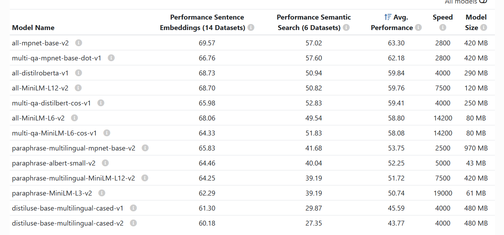

 

 

#### 2. LLM 모델 선정 이유

 
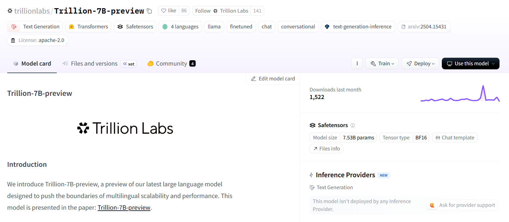
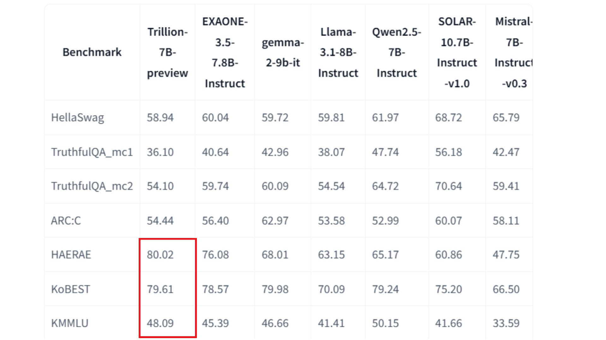
 

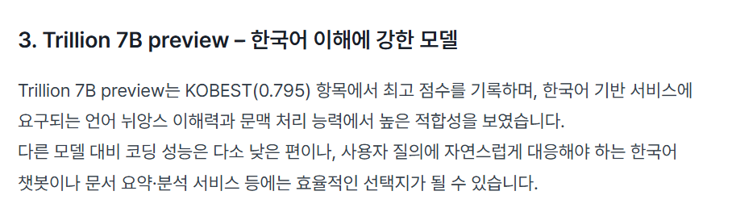
출처: https://elice.io/ko/newsroom/llm-benchmark-korea-elice
 

---

## 4. 🧩시스템 아키텍처 

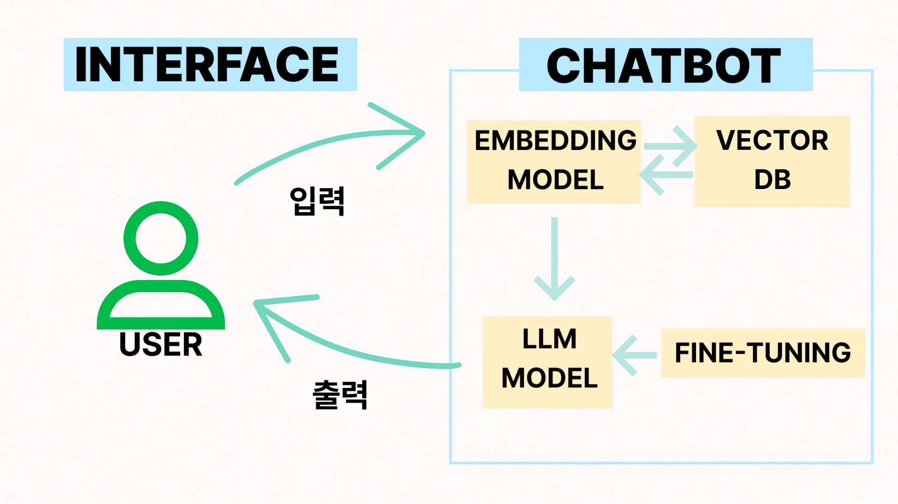

 

---

## 5. 🖼️ WBS

		

---

## 6. 📝요구사항 명세서

---

## 7. 📁수집 데이터 및 전처리 요약

### 7.1 데이터 출처

- [대한민국 구석구석](https://korean.visitkorea.or.kr/main/main.do/) 웹크롤링  

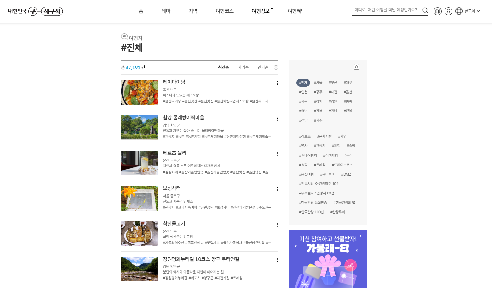
- 대한민국 최대 관광 사이트  

 

**데이터 출처 선정 이유:**  
- 지역별 관광지 전부 확인 가능
- 태그별 관광지 분류 및 정보 추출 가능
- 크롤링 가능(가능 여부 확인 완료)
- 상세 정보(주소, 주차 가능 여부, 장애인 시설 등) 및 리뷰 댓글 포함

  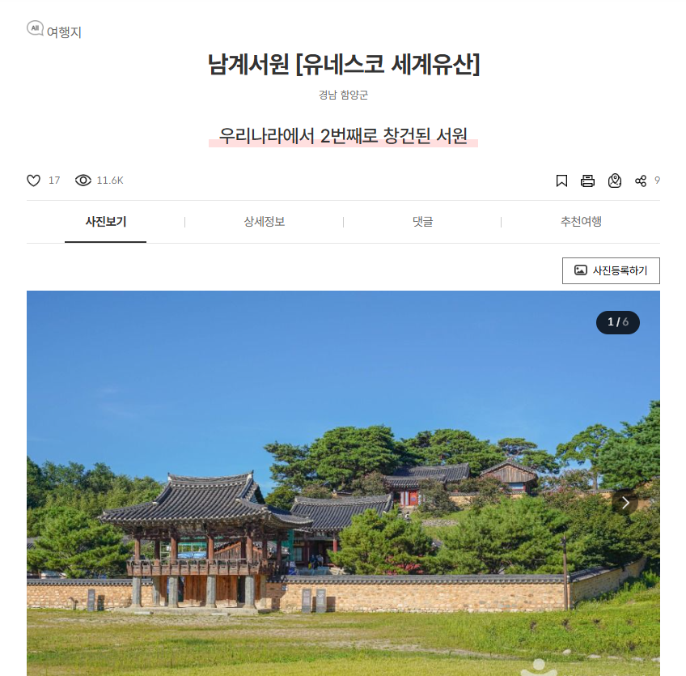
  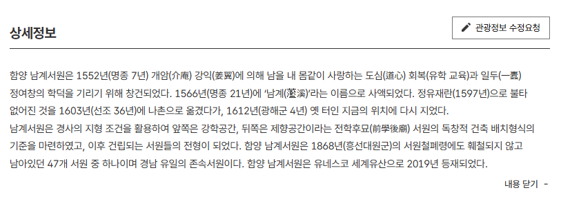

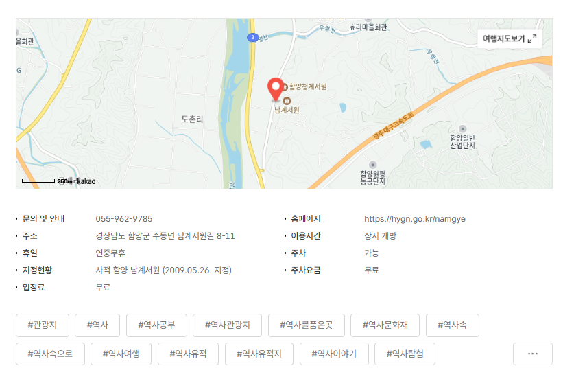 
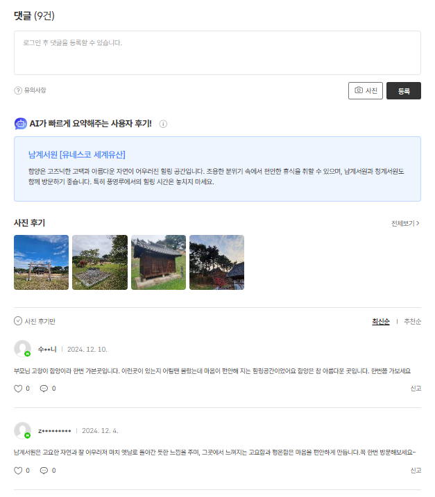

 

---

### 7.2 데이터 특징

- 총 20508개의 데이터, 84개의 컬럼
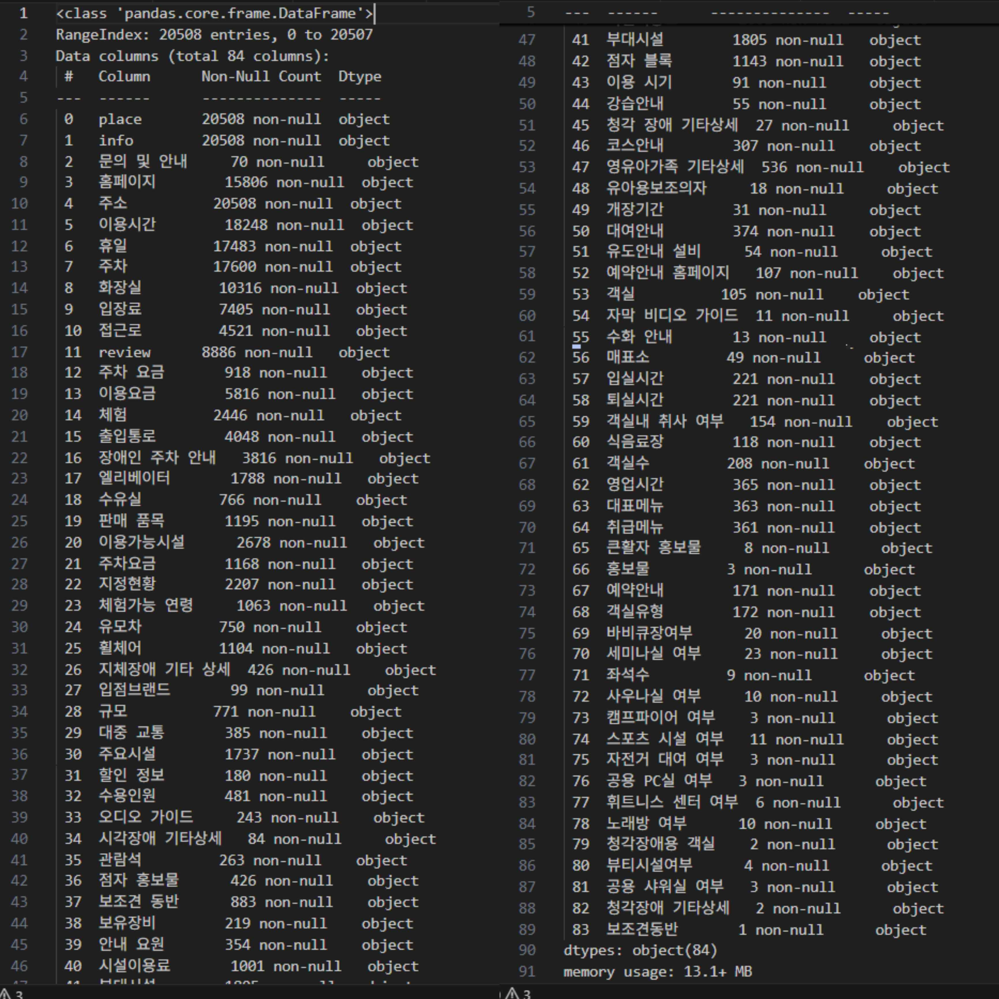

 

### 7.3 데이터 전처리 요약

 

전처리 과정에서 중복된 데이터 및 누락된 정보를 처리하고, 불필요한 컬럼을 정리하는 작업을 진행했습니다. 이를 통해 데이터의 품질을 높였습니다.

**1. 중복 확인:**  
- place 컬럼을 기준으로 중복된 데이터를 찾아 제거하였습니다.

**2. 정보 누락 확인:**  
- info와 review 컬럼에서 누락된 데이터를 찾아 추가 및 수정하였습니다.

**3. 불필요한 컬럼 제거 및 수정:**  
- 지역별 데이터 취합 과정에서 생성된 Unnamed 컬럼들과 크롤링 과정에서 생성된 오류 컬럼 등을 제거하고,  
`\r\n`, `\n`과 같이 컬럼명의 불필요한 문자를 수정하였습니다.

**4. 유사한 이름의 컬럼 합치기:**  
- `체험 프로그램`과 `체험프로그램` 과 같이 유사한 이름의 컬럼을 합치는 과정을 거쳤습니다.

**5. 숙박업소 및 음식점 제외:**  
- 숙박업소 및 음식점, 카페는 전부 제외하였습니다.
- 단, 체험 항목이 있거나, 관광지로 의미가 있을만한 곳들은 포함시켰습니다.
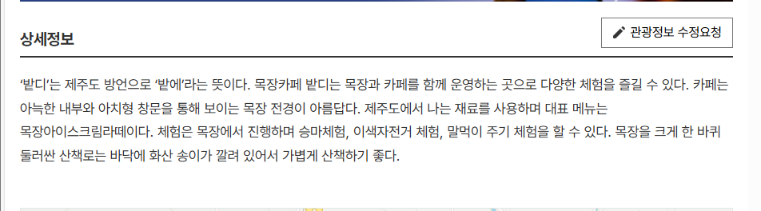

**6. 청소년 수련원과 수련원 제외**  
- 수련원 데이터들을 전부 확인 후 제거했습니다.
 
**7. 이 외 데이터 제거**  
- 안경점, 진돗개 데이터 등의 데이터들을 추가로 제거했습니다.
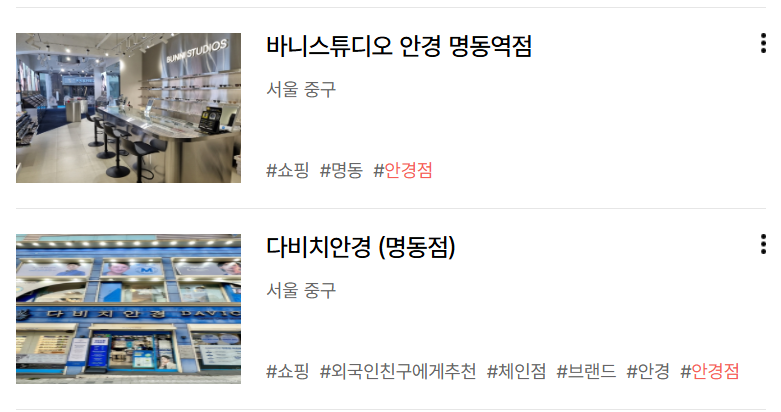 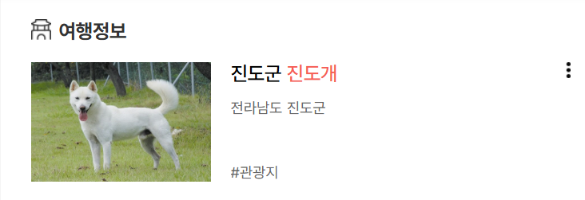

### 7.3 최종 전처리 결과

- 총 19854개의 데이터 ,73개의 컬럼
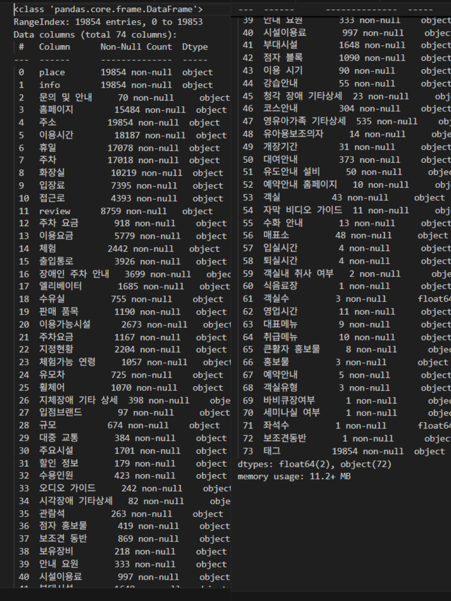
 

---

## 8. 🔗 DB 연동 구현 코드

[Chroma DB 연동 구현 코드](https://github.com/PrettyGirlss/crawling-data/blob/main/RAG/chromadb_with_llm.ipynb)

---

## 9. 📻 테스트 계획 및 결과 보고서

### 9.1 테스트 계획
- 테스트 계획서 : RAG, 파인튜닝 등을 추가하지 않은 sLLM 모델의 응답과 처리 후의 모델의 응답을 비교
- [HyperCLOVA X SEED - a naver-hyperclovax Collection](https://huggingface.co/collections/naver-hyperclovax/hyperclova-x-seed-6808cf1affbfdfeed0481887) 과 [LGAI-EXAONE/EXAONE-3.5-2.4B-Instruct](https://huggingface.co/LGAI-EXAONE/EXAONE-3.5-2.4B-Instruct) 에 
  "부모님과 함께 부산 여행에 간다면 어떤 코스를 추천해줄래?"라는 질문을 입력하여 답변을 비교하였습니다.

### 9.2 결과 보고서
- HyperCLOVA X SEED  
  

- LGAI-EXAONE  
  

  
---
## 10. 🔍진행과정 중 프로그램 개선 노력

### 10.1 데이터 수집 부문

#### 1) 데이터 수집 출처 변경
처음에는 TripAdvisor에서 한 장소 당 최대 25개씩의 리뷰를 크롤링하여 데이터를 수집하고자 하였으나, 웹크롤링을 할 수 없는 환경이었을 뿐 아니라 관광지의 상세 정보(주소, 주차 가능 여부, 화장실 여부, 장애인 시설 등) 부족, 관광지명 언어 불일치 등의 한계점이 있었습니다.  
이후, 한국관광공사의 '대한민국 구석구석' 사이트로부터 지역별 관광지, 상세 정보, 리뷰 등을 크롤링하게 되었습니다.  

#### 2) 추가 크롤링
전체 약 20000개의 데이터 중 리뷰 데이터가 8000개 뿐이었습니다.  
리뷰 데이터를 통해 RAG를 구축하고 임베딩해 관련된 데이터를 추출하기에는 무리가 있다고 판단하여 크롤링한 사이트에서 추가로 데이터를 크롤링하였습니다. 
관광지에 대한 #문화공간, #가볼래터, #관광지, #남녀노소, #여행구독, #연인과함께와 같은 태그 컬럼을 추가하여 벡터 DB에 넣었습니다. 이를 통해 리트리버의 검색 성능이 개선되었습니다.  

### 10.2 임베딩 모델 개선

임베딩 모델 변경:  
초기에는 all-MiniLM-L12-v2 모델을 사용했으나, 인코딩 시간이 너무 길어 all-MiniLM-L6-v2 모델로 변경하여 속도 개선을 이루었습니다.  
변경 후 인코딩 속도가 크게 향상되었습니다.

 

### 10.3 벡터 DB 와 LLM 성능 향상

 

Document 객체 내용 조정 :  
Document 객체의 metadata와 page_content 내용을 기존 데이터의 place, info, review 주소, 태그 등의 컬럼을 다양한 방식으로 조합하여 여러 가지 벡터 DB를 생성하였습니다.  

 

 

### 10.4 청킹 부문

CharacterTextSplitter -> RecursiveCharacterTextSplitter:  
처음에는 CharacterTextSplitter를 사용했으나, 도큐먼트 컨텐츠가 제대로 청킹되지 않았습니다. 로우 수가 기존 데이터와 동일했으나, RecursiveCharacterTextSplitter로 변경하였더니, 총 로우 개수가 늘어나면서 제대로 청킹이 이루어졌습니다.

 

### 10.5 Retriever 객체 개선

프로그램 개선 과정에서 Retriever 객체의 성능을 높이기 위해 metadata_field_info를 정의하여 문서에 대한 더 구체적인 메타데이터 정보를 제공하고, 이를 통해 검색 성능을 향상시켰습니다.

**1. AttributeInfo 클래스를 사용해 관광지 정보**
(예: place, 홈페이지, 주소, 이용시간, 휴일 등)를 세분화하여 검색 성능을 향상시켰습니다.

**2. 문서 내용 및 메타데이터 필드 정보**
지역별 관광지 설명과 메타데이터를 document_content에 결합하여 SelfQueryRetriever에 전달했습니다.

**3. SelfQueryRetriever 개선**
SelfQueryRetriever.from_llm() 메서드를 사용하여 벡터 저장소와 연결된 리트리버 객체를 인스턴스화하고, 더 정확한 검색이 가능하도록 했습니다.

 

### 10.7 Finetuning

##### 사용한 모델들

세 가지 **sLLM 모델**을 활용하여, 기존 데이터셋을 바탕으로 **파인튜닝**을 진행하여 모델 성능을 개선하고자 했습니다. 각 모델의 특성에 맞는 최적화 작업을 진행했으며, 사용된 모델들은 다음과 같습니다:

| 모델 이름 | 특징 | 파인튜닝된 모델 허깅페이스 링크 |
| --- | --- | --- |
| **HyperCLOVA X SEED** | 한국어 최적화 모델로, 고객 리뷰 분석에 강점. 한/중/일 최적화. | [HyperCLOVA X SEED]( https://huggingface.co/0lipa/SEED-1.5B-travel-finetuned) |
| **블라썸 한국어 최적화 모델** | 한국어에 최적화된 파인튜닝 모델로, 효율적인 한국어 문장 생성 가능. | [Bllossom/llama-3.2-Korean-Bllossom-AICA-5B]([https://huggingface.co/Bllossom/llama-3.2-Korean-Bllossom-AICA-5B](https://huggingface.co/CHOROROK/llama3.2-travel-finetuned2)) |
| **Saxo Linkbricks-Horizon AI-Korean** | 한/중/일 최적화된 모델로, 고객 리뷰 분석에서 높은 성능을 보임. | [Saxo/Linkbricks-Horizon-AI-Korean-llama-3.1-sft-dpo-8B](https://huggingface.co/0lipa/Linkbricks-Horizon8.0B-travel-finetuned) |

##### 파인튜닝을 위한 데이터셋 생성

기존 데이터셋을 바탕으로, **파인튜닝을 위한 데이터셋**을 새롭게 생성하여 모델의 성능을 개선하려고 했습니다. 각 모델에 최적화된 데이터를 만들기 위해, **주어진 지시문을 바탕으로 관련된 질문과 답변을 데이터셋으로 구성**하였으며, 이를 통해 **한국어 문장 처리 성능을 높이기 위한 노력**이었습니다.

위 작업을 통해 **모델의 정확도와 효율성**을 개선하는데 집중했습니다.

---

## 11. 💻 수행결과

## 12. 🧑‍💻 한 줄 회고
 
| **이름** | **회고 내용** |
|---|---|
| 김태연 | LLM모델에 rag과 파인튜닝이 왜 필요한지 느낄 수 있는 기회가 되었습니다. 처음 시작 때의 기대에 비해 쉽지 않았던 프로젝트 진행이었지만, 4차단위에서는 3차에서 느꼈던 한계점들을 보완하여 더 나은 성과를 얻을 수 있도록 좀 더 전략적으로 진행해야겠다고 생각하게 되었습니다.  |
| 박지수 | 지수당에 가봤나요? |
| 신승철 | 신승철 똑똑하다. 신승철 바보 아니다.|
| 이재은 | Chroma DB와의 연동을 구현하면서, 데이터를 효과적으로 청킹하고, Document 객체를 생성한 뒤 이를 임베딩하여 데이터베이스에 저장하는 전체 과정을 체계적으로 이해할 수 있었습니다. 모델 성능이 기대에 미치지 못할 때, Document 객체의 metadata와 page_content를 바꿔가면서 여러개의 벡터 데이터베이스를 생성하여 모델 성능을 개선한 경험이 인상 깊었습니다. |
| 조해리 | 처음 계획하고 생각했던 것과 달리 계속해서 예상치 못한 벽에 부딪히는 경험을 한 프로젝트였습니다. 데이터를 수집하고 전처리하는 과정도 계속해서 보충할 점이 생겼고, 파인튜닝을 위한 데이터셋을 준비하는 것도 쉽지 않았습니다. 또한 파인튜닝을 한 모델의 성능 또한 기대와 너무 달라서 조금 더 보완하고 싶다고 생각하게 되었습니다.  |
